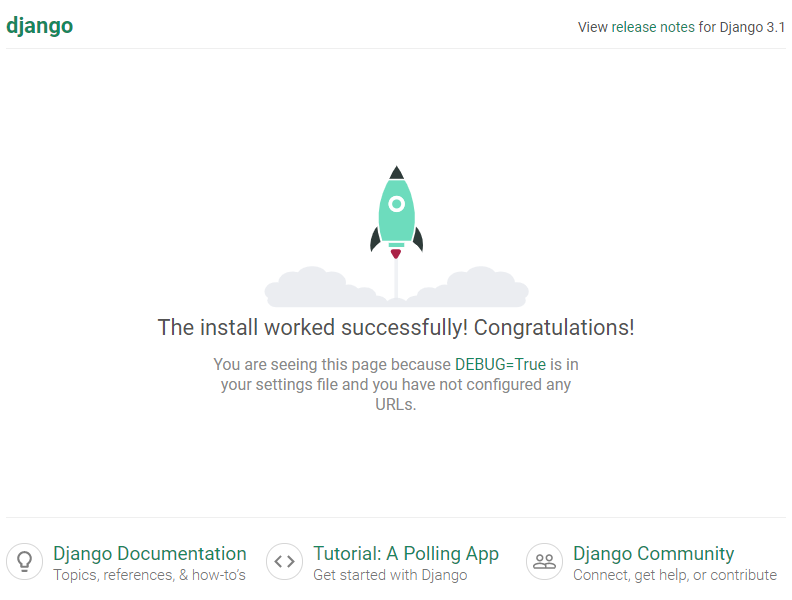
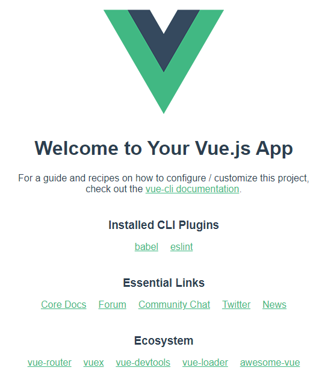

## 初始化

### 初始化django项目

```bash
django-admin startproject [django_project_name] [django_project_dir]
```

如果不提供`django_project_dir`，django将会新建一个名称为`django_project_name`的目录并存放。

django model只能在app中定义。初始化app：

```bash
django-admin startapp [app_name] [app_dir]
```

django项目目录结构：

```
.
└── django_project_name
    ├── app_name
    |   ├── migrations
    |   |   └── __init__.py
    |   ├── __init__.py
    |   ├── admin.py
    |   ├── apps.py
    |   ├── models.py
    |   ├── tests.py
    |   └── views.py
    ├── django_project_name
    │       ├── __init__.py
    │       ├── settings.py
    │       ├── urls.py
    │       └── wsgi.py
    └── manage.py
```


### 初始化Vue.js项目

```bash
vue create -n [vue_project_name]
```

-n参数表示不进行git仓库初始化。

Vue.js项目目录结构：

```
.
└── vue_project_name
    ├── node_modules
    |   └── ...
    ├── public
    |   └── ...
    ├── src
    |   └── ...
    ├── .gitignore
    ├── babel.config.js
    ├── package-lock.json
    ├── package.json
    └── README.md
```

每次修改Vue代码后，需要打包成最终代码。命令：

```bash
cd vue_project_name
npm install
npm run build
```

打包后会在`vue_project_name`文件夹下生成`dist`文件夹。内为完整网页代码。


### 初始配置

修改`django_project_dir/django_project_dir/settings.py`，指定模板、静态资源所在位置。

```python
TEMPLATES = [
    {
        'BACKEND': 'django.template.backends.django.DjangoTemplates',
        'DIRS': [os.path.join(BASE_DIR, django_project_dir, 'dist')],
        'APP_DIRS': True,
        'OPTIONS': {
            'context_processors': [
                'django.template.context_processors.debug',
                'django.template.context_processors.request',
                'django.contrib.auth.context_processors.auth',
                'django.contrib.messages.context_processors.messages',
            ],
        },
    },
]

STATIC_URL = '/static/'
STATICFILES_DIRS = [
    os.path.join(BASE_DIR, 'django_project_dir', 'dist', 'static'),
]
```

在django_project_name文件夹下新建vue.config.js，指定`build`时,在静态文件上一层添加static目录：

```javascript
module.exports = {
    assetsDir: 'static',
};
```

### 项目整体目录结构

```
.
└── django_project_name
    ├── app_name
    |   ├── migrations
    |   |   └── __init__.py
    |   ├── __init__.py
    |   ├── admin.py
    |   ├── apps.py
    |   ├── models.py
    |   ├── tests.py
    |   └── views.py
    ├── django_project_name
    |   ├── __init__.py
    |   ├── settings.py
    |   ├── urls.py
    |   └── wsgi.py
    ├── vue_project_name
    |   ├── dist
    |   |   └── ...
    |   ├── node_modules
    |   |   └── ...
    |   ├── public
    |   |   └── ...
    |   ├── src
    |   |   └── ...
    |   ├── .gitignore
    |   ├── babel.config.js
    |   ├── package-lock.json
    |   ├── package.json
    |   ├── README.md
    |   └── vue.config.js
    └── manage.py
```

## 启动服务

```bash
manage.py runserver
```

将会在本地开启django服务。打开后，显示django默认页面：



修改django_project_dir/urls.py，使用Vue.js接管页面展示。

```python
from django.contrib import admin
from django.urls import path
from django.conf.urls import url
from django.views.generic.base import TemplateView

urlpatterns = [
    path('admin/', admin.site.urls),
    url(r'^$', TemplateView.as_view(template_name="index.html"))
]
```

重启服务，进入Vue.js默认页面：


